# 👅 TongueBalance AI

> **"Shàng yī zhì wèi bìng" (上医治未病)** — The superior doctor prevents disease before it arises.

**TongueBalance AI** is a proactive wellness application developed for the **Gemini 3 Hackathon**. It bridges thousands of years of Traditional Chinese Medicine (TCM) wisdom with cutting-edge Multimodal AI to provide users with a non-invasive, personalized health assessment through simple tongue analysis.

---

## 🌟 Overview

In TCM, the tongue is considered a window into the body's internal state. Changes in tongue color, shape, and coating can indicate imbalances long before physical symptoms appear. **TongueBalance AI** leverages **Gemini 3 Flash Preview** with advanced reasoning capabilities to "see" these subtle indicators and provide actionable lifestyle and dietary recommendations.

### Key Features

* **🤖 AI Multimodal Analysis:** Real-time visual analysis of tongue body and coating using Gemini 3 Flash Preview with deep reasoning mode.
* **🧠 Thinking Transparency:** Watch the AI's diagnostic reasoning in real-time through the "Ancestral Reasoning" panel, revealing classical TCM logic.
* **⚡ Streaming Analysis:** Progressive results display with Server-Sent Events (SSE) for immediate feedback.
* **💊 Personalized Wellness Plans:** Custom dietary advice (foods to include/avoid) based on identified TCM patterns (e.g., Damp-Heat, Qi Deficiency).
* **🕸️ Organ Vitality Dashboard:** Quantified Zàng-Fǔ organ scores (Heart, Liver, Spleen, Lung, Kidney) with radar chart visualization.
* **🔮 Preventative Philosophy:** Focuses on "balancing" the body rather than just treating symptoms.
* **🧘 Qi Cultivation Integration:** Dynamic recommendations for traditional movements like **Ba Duan Jin (八段锦)** and **Jin Gang Gong (金刚功)**.
* **📊 Historical Tracking:** Monitor your wellness journey with analysis history and health trends (improving/stable/declining) with organ vitality progression.
* **📱 Progressive Web App (PWA):** Install on your home screen, works offline, auto-updates in background.
* **🔐 Firebase Authentication:** Secure login with Google OAuth or email/password.
* **👤 Guest Mode:** Try the app without signing up.

---

## 🛠️ Technical Stack

* **AI Brain:** [Google Gemini 3 Flash Preview](https://aistudio.google.com/) (Multimodal Vision & Advanced Reasoning)
* **AI SDK:** Google Generative AI SDK (@google/genai)
* **Frontend:** React 19 + TypeScript 5.8 + Vite 6
* **Backend:** Cloudflare Pages Functions (Serverless API)
* **Authentication:** Firebase Authentication (Google OAuth + Email/Password)
* **Database:** Firebase Firestore (with offline persistence)
* **Storage:** Firebase Storage (tongue image uploads)
* **PWA:** vite-plugin-pwa + Workbox (offline support, install prompts, auto-updates)
* **Deployment:** Cloudflare Pages (Git integration)

---

## 🏗️ System Architecture

TongueBalance AI implements a sophisticated streaming analysis pipeline powered by Gemini 3's advanced reasoning capabilities. The system features real-time "thinking traces" that reveal the AI's diagnostic process, followed by structured panel-based recommendations.

### The 4 TCM Logic Engines

Gemini 3 Flash acts as a multi-faceted TCM practitioner, operating through four specialized reasoning engines:

```mermaid
graph TD
    Start["📱 User Image Capture<br/>(Phone Camera)"] --> Storage["☁️ Firebase Storage<br/>(Image URL Generated)"]
    Storage --> Worker["⚡ Cloudflare Worker<br/>Orchestrator<br/>(Edge Function)"]
    
    Worker --> History["📚 Fetch User History<br/>(Last 3 Analyses)<br/>Firestore REST API"]
    History --> Gemini["🧠 Gemini 3 Thinking Core<br/>thinkingConfig: HIGH<br/>includeThoughts: true"]
    
    Gemini --> Engine1["🔬 Morphological Engine<br/>━━━━━━━━━━━━━━<br/>• Tongue Body Color<br/>• Shape (Swollen/Thin)<br/>• Moisture Level<br/>• Teeth Marks & Cracks<br/>• Coating Analysis<br/>━━━━━━━━━━━━━━<br/>📖 Ref: Nèi Jīng Ch.12"]
    
    Gemini --> Engine2["🩺 Pattern Diagnosis Engine<br/>━━━━━━━━━━━━━━<br/>• Damp-Heat ☀️💧<br/>• Qi Deficiency ⚡<br/>• Yin Deficiency 🌙<br/>• Blood Stasis 🩸<br/>• Liver Qi Stagnation 🌿<br/>━━━━━━━━━━━━━━<br/>📖 Ref: Shàng Hán Lún"]
    
    Gemini --> Engine3["☯️ Organ Balance Engine<br/>━━━━━━━━━━━━━━<br/>Zàng-Fǔ Vitality Scoring (0-100)<br/>• Heart 心 (Tip, Anxiety)<br/>• Liver 肝 (Sides, Irritability)<br/>• Spleen 脾 (Shape, Digestion)<br/>• Lung 肺 (Color, Coating)<br/>• Kidney 腎 (Root, Vitality)<br/>━━━━━━━━━━━━━━<br/>📖 Ref: Five Elements Theory"]
    
    Gemini --> Engine4["🌿 Lifestyle Prescription Engine<br/>━━━━━━━━━━━━━━<br/>• Herbal Formulas 🏮<br/>• Dietary Therapy 🍵<br/>• Qigong Exercises 🧘<br/>• Acupressure Points 📍<br/>• Lifestyle Adjustments ⏰<br/>━━━━━━━━━━━━━━<br/>📖 Ref: Běn Cǎo Gāng Mù"]
    
    Engine1 --> Manifest["📋 Dashboard Manifest<br/>[PANEL] Tagged JSON<br/>━━━━━━━━━━━━━━<br/>• diagnostic<br/>• organ-balance<br/>• diet<br/>• activity<br/>• trend (if history)"]
    
    Engine2 --> Manifest
    Engine3 --> Manifest
    Engine4 --> Manifest
    
    Manifest --> Stream["🌊 SSE Stream<br/>(EventSource Protocol)<br/>Interleaved:<br/>• thoughts (reasoning)<br/>• text (manifest)"]
    
    Stream --> ReactUI["⚛️ React UI<br/>Dynamic Dashboard<br/>━━━━━━━━━━━━━━<br/>• Thinking Scroll 📜<br/>• Vitality Radar 🕸️<br/>• Trend Bars 📊<br/>• Action Cards 🎴"]
    
    ReactUI --> User["👤 User Receives<br/>Preventive Guidance<br/>上医治未病"]
    
    style Gemini fill:#9333ea,stroke:#7c3aed,stroke-width:4px,color:#fff
    style Engine1 fill:#10b981,stroke:#059669,stroke-width:3px,color:#fff
    style Engine2 fill:#f59e0b,stroke:#d97706,stroke-width:3px,color:#fff
    style Engine3 fill:#ef4444,stroke:#dc2626,stroke-width:3px,color:#fff
    style Engine4 fill:#06b6d4,stroke:#0891b2,stroke-width:3px,color:#fff
    style Manifest fill:#8b5cf6,stroke:#7c3aed,stroke-width:3px,color:#fff
    style ReactUI fill:#3b82f6,stroke:#2563eb,stroke-width:3px,color:#fff
```



### Real-Time Streaming Sequence

The analysis pipeline leverages Gemini 3's deep reasoning mode, streaming both internal thoughts and structured output simultaneously:


### Frontend Component Architecture

The React UI uses a dynamic panel registry system that instantiates components based on Gemini's structured output:

```mermaid
classDiagram
    class useTcmStream {
        <<Hook>>
        +string thinkingBuffer
        +string resultContent
        +boolean isStreaming
        +string error
        +boolean isClassicMode
        +startStream(params) Promise~StreamResult~
        +resetStream() void
        📖 Manages SSE connection
        📖 Auto-scroll for reasoning
    }
    
    class StreamingAnalysisResult {
        <<Component>>
        +thinkingBuffer: string
        +resultContent: string
        +isStreaming: boolean
        +error: string
        +language: Language
        📖 Master orchestrator UI
        📖 Renders thinking panel + dashboard
    }
    
    class DynamicDashboard {
        <<Registry Component>>
        +panels: Panel[]
        +language: Language
        +isStreaming: boolean
        +PANEL_COMPONENTS: Record
        📖 Dynamic tile instantiation
        📖 Parses [PANEL] manifest
    }
    
    class Panel {
        <<Interface>>
        +id: string
        +panelType: enum
        +title: string
        +data: any
        📖 Base panel contract
    }
    
    class OrganBalanceChart {
        <<Tile: organ-balance>>
        +data.organScores: object
        +data.bodyType: string
        🕸️ Radar/Spider Chart
        📖 Visualizes Zàng-Fǔ vitality
        📖 Heart/Liver/Spleen/Lung/Kidney
        ━━━━━━━━━━━━━━━
        Scoring: 0-100 scale
        • 0-40: Deficiency (Red)
        • 40-70: Moderate (Yellow)
        • 70+: Optimal (Green)
    }
    
    class TrendPanel {
        <<Tile: trend>>
        +data.trend: improving|stable|declining
        +data.organMetrics: OrganMetric[]
        +data.previousPattern: string
        +data.currentPattern: string
        📊 Progress Bars with Δ%
        📖 Historical comparison
        📖 Only shows if pastAnalyses.length > 0
        ━━━━━━━━━━━━━━━
        Displays:
        • Organ change arrows ↗️↘️
        • Previous vs Current scores
        • Smart Insights 💡
    }
    
    class DietPanel {
        <<Tile: diet>>
        +data.eat: string[]
        +data.avoid: string[]
        +data.recipes: string[]
        🍵 Dietary Therapy Cards
        📖 Food as medicine
        📖 Běn Cǎo Gāng Mù principles
    }
    
    class ActivityPanel {
        <<Tile: activity>>
        +data.exercise: string
        +data.practices: string[]
        +data.lifestyle: string[]
        🧘 Qigong & Acupressure
        📖 Ba Duan Jin, Tai Chi
        📖 Qi cultivation protocols
    }
    
    class DiagnosticPanel {
        <<Tile: diagnostic>>
        +data.pattern: string
        +data.tongueBody: object
        +data.coating: object
        🔬 Pattern Diagnosis
        📖 Presents TCM syndrome
        📖 Tongue morphology data
    }
    
    class OrganMetric {
        <<Interface>>
        +name: string
        +current: number
        +previous: number
        +change: number
        +emoji: string
        📖 Vitality tracking DTO
    }
    
    useTcmStream --> StreamingAnalysisResult : provides state
    StreamingAnalysisResult --> DynamicDashboard : passes panels[]
    DynamicDashboard --> Panel : registry lookup
    Panel <|-- OrganBalanceChart : implements
    Panel <|-- TrendPanel : implements
    Panel <|-- DietPanel : implements
    Panel <|-- ActivityPanel : implements
    Panel <|-- DiagnosticPanel : implements
    TrendPanel --> OrganMetric : contains array
    
    note for DynamicDashboard "🏗️ PANEL_COMPONENTS Registry\n━━━━━━━━━━━━━━━━━━━━━\nMaps panelType to React component:\n{\n  'organ-balance': OrganBalanceChart,\n  'trend': TrendPanel,\n  'diet': DietPanel,\n  'activity': ActivityPanel,\n  'diagnostic': DiagnosticPanel\n}\n━━━━━━━━━━━━━━━━━━━━━\n📖 Enables dynamic UI from Gemini output"
    
    note for TrendPanel "⚠️ CONDITIONAL RENDERING\n━━━━━━━━━━━━━━━━━━━━━\nOnly appears when:\npastAnalyses.length > 0\n━━━━━━━━━━━━━━━━━━━━━\nFirst-time users see:\n• No Trend Panel\n• Only current analysis\n━━━━━━━━━━━━━━━━━━━━━\nReturning users see:\n• Vitality Δ% changes\n• Pattern evolution"
```



### Key Architectural Innovations

1. **Thinking Transparency**: Gemini's internal reasoning is visible in the "Ancestral Reasoning" panel, showing classical TCM diagnostic logic in real-time
2. **Dynamic Panel System**: The UI adapts to Gemini's output structure using `[PANEL type="..." title="..."]` tags containing JSON
3. **Historical Context**: Each analysis considers the user's last 3 results, enabling trend analysis and personalized progression tracking
4. **Streaming Architecture**: Server-Sent Events (SSE) provide immediate feedback, with thoughts and panels updating as they're generated
5. **Organ Vitality Scoring**: Quantifies TCM's Five Element theory (Heart, Liver, Spleen, Lung, Kidney) on a 0-100 scale

---

## ⛩️ The Philosophy: 上医治未病

This project is built on the core TCM principle that health is a state of balance.

> "The superior doctor prevents disease. The mediocre doctor treats the disease before it becomes evident. The inferior doctor treats the full-blown disease."

By providing an accessible tool for daily self-reflection, we empower users to make small adjustments to their diet and lifestyle to maintain harmony and prevent illness.

---

## ⚠️ Medical Disclaimer

**TongueBalance AI is a wellness education tool.** It is not intended to provide medical diagnoses, treatments, or cures. Users should always consult with a licensed healthcare professional or a certified TCM practitioner for medical concerns.

---

## � Quick Start

### For Users

1. **Visit the App**: Navigate to the deployed Cloudflare Pages URL
2. **Sign In or Try Guest Mode**: Use Google OAuth, email/password, or continue as guest
3. **Take a Photo**: Capture a clear image of your tongue in natural lighting
4. **Enter Symptoms** (optional): Describe any health concerns or symptoms
5. **Watch the Analysis**: Observe Gemini's reasoning process in real-time
6. **Review Results**: See your organ vitality scores, patterns, and recommendations
7. **Track Progress**: Return regularly to see trends and improvements over time

### For Developers

```bash
# Clone the repository
git clone [repository-url]
cd tonguebalance-prod

# Install dependencies
npm install

# Set up environment variables
# Create .env file with:
# - VITE_FIREBASE_API_KEY
# - VITE_FIREBASE_AUTH_DOMAIN
# - VITE_FIREBASE_PROJECT_ID
# - VITE_FIREBASE_STORAGE_BUCKET
# - VITE_FIREBASE_MESSAGING_SENDER_ID
# - VITE_FIREBASE_APP_ID
# - GEMINI_API_KEY (for Cloudflare Workers)

# Run development server
npm run dev

# Build for production
npm run build

# Deploy to Cloudflare Pages
# Push to main branch (auto-deploys via Git integration)
```

---

## 🎯 Gemini 3 Showcase Features

This application leverages cutting-edge Gemini 3 capabilities:

### Advanced Reasoning with Thinking Mode
- **`thinkingLevel: 'HIGH'`**: Enables deep diagnostic reasoning following TCM principles
- **`includeThoughts: true`**: Exposes internal reasoning process to users for transparency
- Demonstrates how AI can explain its decision-making process in medical/wellness contexts

### Multimodal Vision Analysis
- Processes tongue images to identify subtle visual indicators
- Analyzes color, shape, texture, coating thickness, moisture levels
- Correlates visual observations with user-reported symptoms

### Structured Output Generation
- Produces complex JSON manifests embedded in markdown
- Dynamic panel system (`[PANEL type="..." title="..."]...JSON...[/PANEL]`)
- Enables programmatic UI generation from AI output

### Historical Context Integration
- Incorporates user's last 3 analyses into system prompt
- Performs longitudinal health tracking and pattern evolution analysis
- Demonstrates temporal reasoning and personalization

### Streaming for Real-Time UX
- Server-Sent Events (SSE) provide progressive disclosure
- Interleaved `thought` and `text` chunks create engaging user experience
- Shows AI's work in progress rather than just final results

---

## �📖 Documentation

Comprehensive documentation is available in the [`/docs`](./docs) folder:

- **[Dynamic Dashboard System](./docs/dynamic-dashboard.md)** - Complete implementation guide with panel types, architecture, and quick reference
- **[System Architecture](./docs/architecture.md)** - Visual diagrams, data flow, and state management
- **[Integration Guide](./docs/integration.md)** - Legacy guide for upgrading from older versions

Start with the [Documentation Index](./docs/README.md) for an overview.

---

## 🤝 Acknowledgments

* Developed for the **Gemini 3 Hackathon**.
* Inspired by the rich heritage of Traditional Chinese Medicine.
